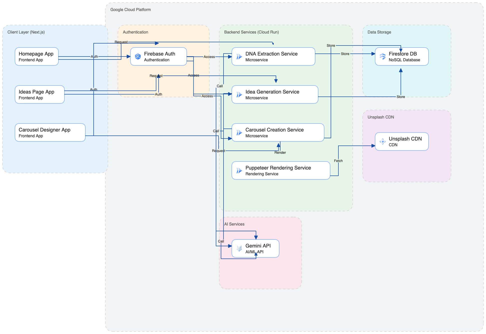

# 🎯 NicheAI - LinkedIn Carousel Generator

<div align="center">

**Create viral LinkedIn carousels in minutes with AI-powered personalization**

[](https://nextjs.org/)
[](https://www.typescriptlang.org/)
[](https://firebase.google.com/)
[](https://cloud.google.com/run)
[](LICENSE)

[Demo](#-demo) • [Features](#-features) • [Quick Start](#-quick-start) • [Architecture](#-architecture) • [API](#-api-documentation) • [Deployment](#-deployment)

</div>

---

## 📖 Table of Contents

- [Overview](#-overview)
- [Features](#-features)
- [Demo](#-demo)
- [Quick Start](#-quick-start)
- [Architecture](#-architecture)
- [Technology Stack](#-technology-stack)
- [Project Structure](#-project-structure)
- [API Documentation](#-api-documentation)
- [Deployment](#-deployment)
- [Environment Variables](#-environment-variables)
- [Development](#-development)
- [Contributing](#-contributing)
- [License](#-license)

---

## 🚀 Overview

**NicheAI** is an intelligent LinkedIn content generator that helps professionals create engaging carousel posts in minutes. Simply upload your LinkedIn profile PDF, and our AI analyzes your professional background to generate personalized content ideas. Each idea transforms into a beautifully designed 10-slide carousel—ready to download and share on LinkedIn.

🌐 **Live Demo**: [nicheai-1763374270.web.app](https://nicheai-1763374270.web.app/)

---

## ✨ Features

### Core Features

| Feature | Description |
|---------|-------------|
| **🔐 Secure Authentication** | Quick sign-in with your Google account via Firebase |
| **📄 Profile Analysis** | AI extracts your professional story from your LinkedIn PDF |
| **🤖 AI-Powered Ideas** | Google Gemini 2.0 generates content ideas based on your niche |
| **🎨 5 Beautiful Themes** | Purple Dream, Ocean Blue, Fresh Green, Sunset Orange, Deep Indigo |
| **🖼️ Smart Image Matching** | 50+ keyword-to-image mappings for contextual illustrations |
| **📥 Flexible Export** | Download as individual PNGs or a single merged PDF |
| **💾 Cloud Backup** | All your ideas and carousels saved securely in Firestore |
| **⚡ Production-Grade PDF** | High-quality PDF rendering using Puppeteer headless Chrome |

---

## 🎬 Demo

### Workflow

```
1. Upload LinkedIn PDF → 2. AI Analyzes Profile → 3. Generate Ideas → 4. Create Carousel → 5. Download & Post
```

### Screenshots

**Homepage**
- Sign in securely with your Google account
- Upload your LinkedIn profile PDF
- View your professional DNA dashboard
- Generate ideas with one click

**Ideas Page**
- Browse 15 personalized content ideas
- Select any idea to create a carousel
- All ideas automatically saved to your account

**Carousel Editor**
- Live preview of all 10 slides
- Switch between 5 professional color themes
- Real-time rendering as you customize
- Download individual slides as PNG files
- Export complete carousel as a single PDF

---

## 🏃 Quick Start

### Prerequisites

- Node.js 20+ 
- npm/yarn/pnpm
- Firebase project
- Google Cloud account (for deployment)
- Gemini API key

### Installation

```bash
# Clone the repository
git clone https://github.com/Durgesh-Vaigandla/NicheAI.git
cd NicheAI

# Install frontend dependencies
npm install

# Install backend dependencies
cd backend
npm install
cd ..

# Set up environment variables
cp .env.example .env.local
# Edit .env.local with your Firebase & Gemini credentials

# Run development server
npm run dev

# In another terminal, run backend
cd backend
npm run dev
```

Open [http://localhost:3000](http://localhost:3000) to see the app.

---

## 🏗️ Architecture



---

## 🛠️ Technology Stack

### Frontend

| Technology | Version | Purpose |
|------------|---------|---------|
| **Next.js** | 16.0.3 | React framework with App Router & static export |
| **React** | 19.2.0 | UI library |
| **TypeScript** | 5+ | Type safety |
| **Tailwind CSS** | 4.0 | Utility-first styling |
| **Firebase** | 12.6.0 | Auth, Firestore, Hosting |
| **dom-to-image-more** | 3.7.2 | PNG slide export |
| **html2canvas** | 1.4.1 | Canvas rendering |
| **jspdf** | 3.0.3 | Client-side PDF generation (alternative) |
| **react-hot-toast** | 2.6.0 | Toast notifications |

### Backend

| Technology | Version | Purpose |
|------------|---------|---------|
| **Node.js** | 20+ | Runtime |
| **Express** | 4.18.2 | API server |
| **TypeScript** | 5.3.3 | Type safety |
| **Puppeteer** | 24.30.0 | Headless Chrome for PDF generation |
| **pdf-lib** | 1.17.1 | PDF merging |
| **pdf-parse** | 1.1.1 | PDF text extraction |
| **@google/generative-ai** | 0.2.0 | Gemini API client |
| **Firebase Admin** | 12.0.0 | Server-side Firebase |
| **multer** | 1.4.5-lts.1 | File upload middleware |
| **cors** | 2.8.5 | CORS handling |
| **dotenv** | 16.3.1 | Environment variables |

### Cloud Infrastructure

- **Google Cloud Run**: Serverless container hosting
- **Google Container Registry**: Docker image storage
- **Firebase Firestore**: NoSQL database
- **Firebase Authentication**: User management
- **Unsplash CDN**: Image delivery

---

## 📁 Project Structure

```
nicheai/
├── app/                          # Next.js App Router
│   ├── page.tsx                  # Homepage (DNA upload)
│   ├── layout.tsx                # Root layout
│   ├── globals.css               # Global styles
│   ├── ideas/
│   │   └── page.tsx              # Ideas generation page
│   └── carousel/
│       └── page.tsx              # Carousel editor (718 lines, static route)
│
├── backend/                      # Express API server
│   ├── src/
│   │   ├── index.ts              # Express server with CORS & routes
│   │   └── routes/
│   │       ├── extract-dna.ts    # PDF parsing with pdf-parse + Gemini
│   │       ├── generate-ideas.ts # AI idea generation (Gemini)
│   │       ├── generate-carousel.ts # Carousel structure generation
│   │       └── generate-pdf.ts   # Puppeteer PDF rendering + merge
│   ├── Dockerfile                # Cloud Run container
│   ├── .gitignore                # Backend exclusions
│   └── package.json              # Backend dependencies
│
├── src/
│   ├── lib/
│   │   └── firebase.ts           # Firebase client config
│   └── types/
│       └── dom-to-image-more.d.ts # TypeScript declarations
│
├── public/                       # Static assets
├── .env.local                    # Environment variables (gitignored)
├── .gitignore                    # Git exclusions
├── package.json                  # Frontend dependencies
├── tsconfig.json                 # TypeScript config
├── next.config.ts                # Next.js config
├── tailwind.config.ts            # Tailwind config
├── ARCHITECTURE.md               # System design doc
└── README.md                     # This file
```

---

## 📡 API Documentation

### Base URL

- **Development**: `http://localhost:8080`
- **Production**: `https://nicheai-backend-355630243364.us-central1.run.app`

### Endpoints

#### 1. Health Check

```http
GET /health
```

**Response**
```json
{
  "status": "ok",
  "timestamp": "2025-11-18T03:58:05.689Z"
}
```

---

#### 2. Extract DNA

```http
POST /extract-dna
Content-Type: multipart/form-data
```

**Request**
```
FormData {
  pdf: File,
  userId: string
}
```

**Response**
```json
{
  "success": true,
  "dna": {
    "name": "John Doe",
    "title": "Senior Software Engineer",
    "niche": "AI & Machine Learning",
    "skills": ["Python", "TensorFlow", "NLP"],
    "experience": ["5+ years in AI research"],
    "achievements": ["Published 10+ papers"]
  }
}
```

**Error Responses**
- `400`: Invalid PDF format
- `500`: Gemini API failure

---

#### 3. Generate Ideas

```http
POST /generate-ideas
Content-Type: application/json
```

**Request**
```json
{
  "userDNA": {
    "name": "John Doe",
    "niche": "AI & Machine Learning"
  },
  "userId": "firebase-user-id"
}
```

**Response**
```json
{
  "success": true,
  "ideas": [
    "5 AI trends that will dominate 2025",
    "How I built my first ML model in 30 days",
    "..."
  ]
}
```

---

#### 4. Generate PDF

```http
POST /generate-pdf
Content-Type: application/json
```

**Request**
```json
{
  "carouselData": {
    "title": "5 AI Trends",
    "slides": [
      {
        "slideNumber": 1,
        "heading": "5 AI Trends",
        "content": "That Will Dominate 2025",
        "visualSuggestion": "rocket"
      },
      {
        "slideNumber": 2,
        "heading": "1. Multimodal AI",
        "content": "Text + Image + Video understanding",
        "visualSuggestion": "brain"
      }
    ]
  },
  "userDNA": {
    "name": "John Doe",
    "title": "AI Engineer"
  },
  "theme": "purple"
}
```

**Response**
```
Content-Type: application/pdf
Content-Disposition: attachment; filename="5 AI Trends.pdf"

[Binary PDF data with all 10 slides merged]
```

**Features**
- Puppeteer headless Chrome rendering
- 1080x1080px per slide @ 2x scale
- Unsplash images with crossOrigin handling
- All slides merged into single PDF via pdf-lib
- Average response time: ~8-12 seconds

---

## 🚀 Deployment

### Backend (Google Cloud Run)

#### Prerequisites

1. Install [Google Cloud SDK](https://cloud.google.com/sdk/docs/install)
2. Authenticate: `gcloud auth login`
3. Set project: `gcloud config set project YOUR_PROJECT_ID`

#### Deploy

```bash
cd backend

# Build and push Docker image
gcloud builds submit --tag gcr.io/YOUR_PROJECT_ID/nicheai-backend .

# Deploy to Cloud Run
gcloud run deploy nicheai-backend \
  --image gcr.io/YOUR_PROJECT_ID/nicheai-backend \
  --platform managed \
  --region us-central1 \
  --allow-unauthenticated \
  --set-env-vars GEMINI_API_KEY=your_key_here

# Get service URL
gcloud run services describe nicheai-backend --region us-central1
```

**Backend Configuration**
- Base Image: `node:20-slim`
- Puppeteer dependencies auto-installed
- CORS enabled for Firebase Hosting & localhost
- 50MB request size limit for PDF uploads
- Health check endpoint at `/health`

---

### Frontend (Vercel/Firebase Hosting)

#### Vercel Deployment

```bash
# Install Vercel CLI
npm i -g vercel

# Deploy
vercel --prod
```

#### Firebase Hosting

```bash
# Build static export
npm run build

# Deploy
firebase deploy --only hosting
```

**Update Environment Variables**

After backend deployment, update `.env.local`:

```env
NEXT_PUBLIC_CLOUD_RUN_URL=https://your-backend-url.run.app
```

---

## 🔐 Environment Variables

### Frontend (`.env.local`)

```env
# Firebase Configuration
NEXT_PUBLIC_FIREBASE_API_KEY=your_api_key
NEXT_PUBLIC_FIREBASE_AUTH_DOMAIN=your_project.firebaseapp.com
NEXT_PUBLIC_FIREBASE_PROJECT_ID=your_project_id
NEXT_PUBLIC_FIREBASE_STORAGE_BUCKET=your_project.appspot.com
NEXT_PUBLIC_FIREBASE_MESSAGING_SENDER_ID=your_sender_id
NEXT_PUBLIC_FIREBASE_APP_ID=your_app_id

# Gemini API
GEMINI_API_KEY=your_gemini_api_key

# Backend URL
NEXT_PUBLIC_CLOUD_RUN_URL=https://nicheai-backend.run.app
```

**Backend (`.env` or Cloud Run environment variables)**

```env
# Gemini API (Required)
GEMINI_API_KEY=your_gemini_api_key

# Firebase Admin SDK (JSON string or use Application Default Credentials)
FIREBASE_ADMIN_SDK='{"type":"service_account","project_id":"...","private_key":"..."}'
# OR
FIREBASE_PROJECT_ID=your_project_id

# Server Config
PORT=8080
NODE_ENV=production
```

**Get Credentials**

1. **Firebase Client Config**: [Firebase Console](https://console.firebase.google.com/) → Project Settings → General → Your apps
2. **Gemini API Key**: [Google AI Studio](https://aistudio.google.com/app/apikey)
3. **Firebase Admin SDK**: Firebase Console → Project Settings → Service Accounts → Generate new private key (download JSON)
4. **Backend URL**: After deploying to Cloud Run, copy the service URL

---

## 💻 Development

### Run Locally

**Frontend**
```bash
npm run dev
# Open http://localhost:3000
```

**Backend**
```bash
cd backend
npm run dev
# Server runs on http://localhost:8080
```

### Build Production

**Frontend**
```bash
npm run build
npm run start
```

**Backend**
```bash
cd backend
npm run build
npm run start
```

### Testing

**Backend Health Check**
```bash
curl http://localhost:8080/health
```

**Frontend Build**
```bash
npm run build
# Check for TypeScript errors
```

### Code Quality

```bash
# Lint
npm run lint

# Format (if using Prettier)
npm run format
```

---

## 🎨 Customization

### Add New Color Theme

Edit `app/carousel/page.tsx`:

```typescript
const COLOR_THEMES = {
  // ... existing themes
  teal: {
    name: 'Teal Wave',
    bg: '#f0fdfa',
    from: '#14b8a6',
    to: '#06b6d4',
    accentBg: '#ccfbf1',
    accentBorder: '#14b8a6',
    accentText: '#134e4a',
    gradient: 'from-teal-500 to-cyan-500',
  },
};
```

### Add Unsplash Image Mapping

In `getImageUrl()` function:

```typescript
const imageMapping: { [key: string]: string } = {
  // ... existing mappings
  'robot': 'https://images.unsplash.com/photo-1485827404703-89b55fcc595e?w=400&h=400&fit=crop',
};
```

### Modify Slide Template

Edit `LinkedInSlideTemplate` component for custom layouts, fonts, or spacing.

---

## 📊 Performance

### Metrics

| Metric | Value |
|--------|-------|
| **Frontend Build Time** | ~1.5-2s (static export) |
| **Backend Cold Start** | ~3-5s (Cloud Run) |
| **PDF Generation** | ~8-12s (10 slides) |
| **PNG Export** | ~1-2s per slide (client-side) |
| **Static Export** | 6 pages pre-rendered |

### Optimizations

- **Static Export**: Next.js static HTML generation for Firebase Hosting
- **sessionStorage Routing**: No URL params needed for carousel navigation
- **Puppeteer Wait Strategy**: `domcontentloaded` instead of `networkidle0` (faster)
- **PDF Merging**: Single merged PDF instead of 10 separate files
- **CORS Caching**: 24-hour maxAge for preflight requests
- **Image CDN**: Direct Unsplash URLs with crossOrigin support

---

## 🐛 Troubleshooting

### Common Issues

**1. PDF Generation Timeout on Cloud Run**

```bash
# Increase memory and timeout
gcloud run services update nicheai-backend \
  --memory 2Gi \
  --timeout 60s \
  --region us-central1
```

**2. Carousel Page Shows Homepage After Navigation**

✅ Fixed: Using sessionStorage instead of URL params for static export compatibility

**3. CORS Error from Backend**

- Verify your frontend URL is in `CORS origins` in `/backend/src/index.ts`
- Check browser console for actual origin being blocked
- Rebuild and redeploy backend after CORS changes

**4. Images Not Loading in PDF**

- Unsplash CDN must be accessible from Cloud Run
- Check `crossOrigin="anonymous"` in image tags
- Verify image URLs return 200 status

**5. Firebase Auth Error**

- Check Firebase config in `.env.local` matches Firebase Console
- Verify domain is authorized in Firebase Console → Authentication → Settings
- Clear browser cache and cookies

---

## 🤝 Contributing

Contributions are welcome! Please follow these steps:

1. Fork the repository
2. Create a feature branch: `git checkout -b feature/amazing-feature`
3. Commit changes: `git commit -m 'Add amazing feature'`
4. Push to branch: `git push origin feature/amazing-feature`
5. Open a Pull Request

### Development Guidelines

- Follow TypeScript best practices
- Write descriptive commit messages
- Add comments for complex logic
- Test thoroughly before submitting
- Update documentation for new features

---

## 📄 License

This project is licensed under the **MIT License** - see the [LICENSE](LICENSE) file for details.

---

## 👥 Contributors

**Durgesh Vaigandla**  
[GitHub](https://github.com/Durgesh-Vaigandla) • [LinkedIn](https://www.linkedin.com/in/durgesh-vaigandla)

**Anupravi Garg**  
[GitHub](https://github.com/anupravigarg07) • [LinkedIn](https://www.linkedin.com/in/anupravigarg/)

---

## 🙏 Acknowledgments

- [Next.js](https://nextjs.org/) - React framework
- [Firebase](https://firebase.google.com/) - Backend as a service
- [Google Gemini](https://ai.google.dev/) - AI model
- [Unsplash](https://unsplash.com/) - Free images
- [Puppeteer](https://pptr.dev/) - Headless Chrome
- [Tailwind CSS](https://tailwindcss.com/) - Styling framework

---

## 📞 Support

Need help? Here's how to reach us:

- **Issues**: Open an issue on [GitHub](https://github.com/Durgesh-Vaigandla/NicheAI/issues)
- **Questions**: Start a [Discussion](https://github.com/Durgesh-Vaigandla/NicheAI/discussions)
- **Live Demo**: [nicheai-1763374270.web.app](https://nicheai-1763374270.web.app/)
